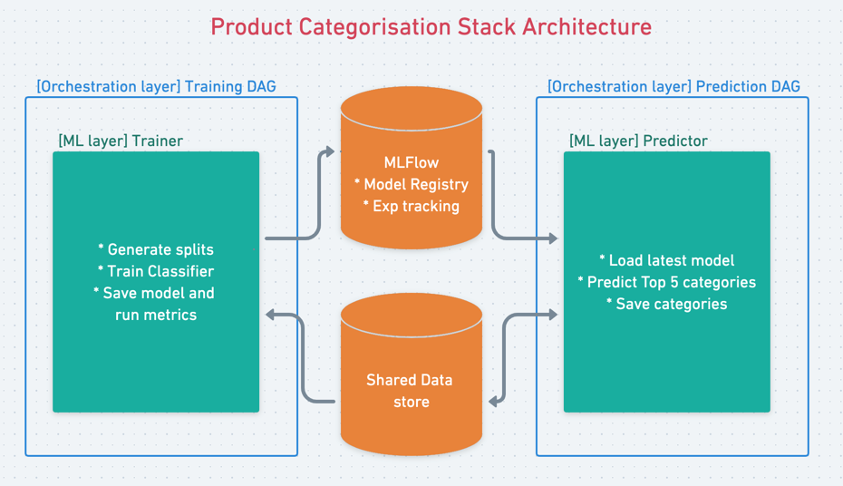

# Better Categories 4All: A multi-tenant multi-client product categorising stack

**The steps to reproduce training and inference are in the end of this file, sorry for the long explanation.**


## Problem scope

We want to create a full product categorization stack for multiple clients.
For each client, and each product we want to find the 5 most suitable categories.

## Project structure
The project is split into two layers:
* **ML layer**: the python package for training and serving model. 
  It's a `pipenv` based project. The `Pipfile` include all required dependencies.
  The python environment generated by `pipenv` is used to run the training/inference
  and run also unit tests. Code is generic for all clients.
* **Orchestration layer**: the Airflow DAGs for training and prediction. 
  Each client has its own training DAG and its prediction DAG. 
  These DAGs uses the Airflow `BashOperator` to execute training and prediction
  inside the `pipenv` environment.
  


#### Why one DAG per a client instead of a single DAG for all client ?

We could have a single DAG that train all clients. 
So each client has its own training task inside the same DAG.
I chose rather to build a separate DAG for each client. 
Several reasons motivated my decision:
* In my past experiences, some individual cients may have problem s
  with their data and it's more practical to have a DAG per client
  when it's come to day to day monitoring.
* New clients may come and other may leave and we may endup with a DAG
that keeps constantly adding new Task and loosing others and 
  it's against airflow best practicies. 
* It make sens to have one failed DAG and 99 other successful 
  DAGs rather than a single DAG failing all the time because 
  of one random client training failing each day.

## Training

In this part we will train a classification model for each client.

### Training package

The package `categories_classification` include a training function `train_model`.
It takes the following inputs:
* `client_id`: the id of the client in training dataset
* `features`: a list of features names to use in training
* `model_params`: a dict of params to be passed to model python class.
* `training_date`: the execution date of training, used to track the training run.

The chosen model is `scikit-learn` implementation of random forest `sklearn.ensemble.RandomForestClassifier`.
For the sake of simplicity, we didn't fine tune model parameters, but optimal params can be set in config.

In addition to `train_model` function, a cli binary is created to be able to run 
training directly from command line. The binary command `trainer` runs the training:
```bash
pipenv run python categories_classification_cli.py trainer --help

Usage: categories_classification_cli.py trainer [OPTIONS]

Options:
  --client_id TEXT     The id of the client.  [required]
  --features TEXT      The list of input features.  [required]
  --model_params TEXT  Params to be passed to model.  [required]
  --training_date TEXT  The training date.  [required]
  --help               Show this message and exit.
```

### Data and model paths

All data are stored in a command base path retrieved from 
environment variable `DATA_PREFIX`, default is `./data`.
Given a client id, training data is loaded from `$DATA_PREFIX/train/client_id=<client_id>/data_train.csv.gz`.

### Splitting data

Before training, data is split into training set and test set. 
The train set is used to train the model while the test set is 
used to evaluate the model after training. Evaluation score is logged.

### Model tracking and versioning

The whole training event is tracked in Mlfow as a training run. Each client hash its own experiments and its own 
model name following the convention "<client_id>_model".
The tracking process saves also metrics and model parameters in the same run metadata.

Finally, the model is saved in Mlflow Registry with name "<client_id>_model". 
Saving the model means a new **model version** is saved in Mlflow, 
as the same model may have multiple versions.

## Prediction

In this part, we will predict product categories using previously trained model.

### Prediction package

The package `categories_classification` include a prediction function `predict_categories`.
It takes the following inputs:
* `client_id`: the id of the client in training dataset
* `inference_date`: an inference execution date to version output categories

The prediction is done through spark so that it can be done on big datasets.
Prediction dataset is loaded in spark DataFrame. We use Mlflow to get the latest model version and load latest model.
The model is then broadcasted in Spark in order to be available in Spark workers.
To apply the model to the prediction dataset, I use a **new Spark 3.0 experimental feature** called `mapInPandas`. 
This Dataframe method maps an iterator of batches (pandas Dataframe) using a prediction used-defined function that 
outputs also a pandas Dataframe. This is done thanks to `PyArrow` efficient data transfer between Spark JVM and python pandas runtime.

### Prediction function

The advantage of `mapInPandas` feature comparing to classic `pandas_udf` is that we can add more rows than we have as input.
Thus for each product, we can output 5 predicted categories with their probabilities and ranked from 0 to 4.
The predicted label are then persisted to filesystem as parquet dataset.

### Model version retrieval

Before loading the model, we use Mlflow to get the latest version of the model. In production system we probabilities
want to push model to staging, verify its metrics or validate it before passing it to production.
Let's suppose that we are working the same stage line, we use `MlflowClient` to connect to Mlflow Registry and get the 
latest model version. The version is then used to build the latest model uri.

## Reproducing training and inference

### Pipenv initialization

First you need to check you have pipenv installed locally otherwise you can install it with `pip install pipenv`.

Then you need to initialize the pipenv environment with the following command:
```bash
make init-pipenv
```

This may take some time as it will install all required dependencies. Once done you can run linter (pylint) and unit tests:
```bash
make lint
make unit-tests
```

### Airflow/Mlflow initialization

You need also to initialize the local airflow stack, thus building a custom airflow docker image including the pipenv 
environment, the mlflow image and initializing the Airflow database.

```bash
make init-airflow
```

### Generate DAGs

Airflow dags needs to be generated using config file in `conf/clients_config.yaml`. 
It's already created with the 10 clients example datasets.
But if you want you can add new clients or change the actual configuration.
For each client you must include the list of features and optional model params.

Then, you can generate DAGs using the following command:
```bash
make generate-dags
```

This will can the script `scripts/generate_dags.py` which will:
* load training and inference DAG templates from `dags_templates`, they are jinja2 templates.
* load conf from `conf/clients_config.yaml`
* render DAG for each client and each template

### Start local Airflow

You can start local airflow with following command:
```bash
make start-airflow
```

Once all services started, you can go to you browser and visit:
* Airflow UI in `http://localhost:8080`
* Mlflow UI in `http://localhost:5000`

### Run training and inference

In Airflow all DAGs are disabled by default. To run training for a client you can enable the DAG and it will 
immediately trigger the training. 

Once the model in Mlflow, you can enable the inference DAG and it will immediately trigger a prediction.

### Inspect result
To inspect result you run a local jupyter, you do it with:
```bash
make run-jupyter
```
Then visit notebook `inspect_inference_result.ipynb` and run it to check the prediction output.
